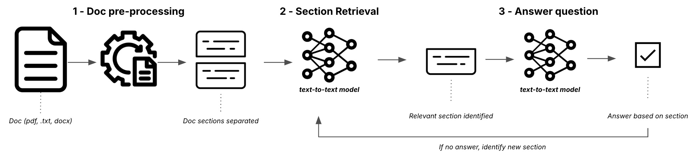

<p align="center">
  
</p>

# Structured-QA: Academic Paper Analysis

> A specialized fork of [Mozilla.ai's Structured-QA Blueprint](https://github.com/mozilla-ai/structured-qa) optimized for analyzing academic papers and research documents.

[](https://discord.gg/YuMNeuKStr)
[](https://github.com/mozilla-ai/structured-qa/actions/workflows/docs.yaml/)
[](https://github.com/mozilla-ai/structured-qa/actions/workflows/tests.yaml/)
[](https://github.com/mozilla-ai/structured-qa/actions/workflows/lint.yaml/)

This specialized fork demonstrates how to use open-source models and a simple LLM workflow to analyze academic papers and research documents. Key features include:

- 📚 Optimized for academic paper analysis
- 🔍 Intelligent section parsing and navigation
- 📊 Preservation of mathematical notation and citations
- 🎯 Focused on technical precision and academic rigor
- 🤖 Using Qwen 7B model for improved comprehension

A lightweight, open-source solution for answering questions about structured documents using simple LLM workflows, designed as an efficient alternative to complex RAG systems.

<p align="center">
  
</p>



📘 To explore the original project and discover other Blueprints, visit the [**Blueprints Hub**](https://developer-hub.mozilla.ai/blueprints/query-structured-documents-using-a-lightweight-llm-workflow).


### 👉 📖 For more detailed guidance on using this project, please visit our [Docs here](https://mozilla-ai.github.io/structured-qa/).


## Quick-start

Get started with academic paper analysis using one of these options:

| Google Colab | HuggingFace Spaces  | GitHub Codespaces |
| -------------| ------------------- | ----------------- |
| [](https://colab.research.google.com/github/mozilla-ai/structured-qa/blob/main/demo/notebook.ipynb) | [](https://huggingface.co/spaces/mozilla-ai/structured-qa) | [](https://github.com/codespaces/new?hide_repo_select=true&ref=main&repo=904169776&skip_quickstart=true&machine=standardLinux32gb) |

### Local Installation

1. Clone the repository:
```bash
git clone https://github.com/alexmeckes/academic-paper-structured-qa.git
cd academic-paper-structured-qa
pip install -e .
```

2. Launch the academic paper analysis UI:
```bash
python -m streamlit run demo/app.py
```

### Command Line Usage

Install from pip:
```bash
pip install structured-qa
```

Analyze a paper:
```bash
structured-qa \
--question "What were the key findings of this study?" \
--input_file "path/to/your/paper.pdf" \
--output_dir "output/directory"
```

## Key Differences from Original Blueprint

This fork differs from the original Structured-QA Blueprint in several ways:
- Uses the more powerful Qwen 7B model for better academic comprehension
- UI optimized for academic paper analysis
- Enhanced section parsing for research paper structure
- Better handling of technical content and mathematical notation

## Credits

This project is a fork of [Mozilla.ai's Structured-QA Blueprint](https://github.com/mozilla-ai/structured-qa). The original project demonstrates a lightweight approach to document QA without requiring complex RAG systems or large context windows.

## License

This project is licensed under the Apache 2.0 License. See the [LICENSE](LICENSE) file for details.

## Contributing

Contributions are welcome! To get started, you can check out the [CONTRIBUTING.md](CONTRIBUTING.md) file.
